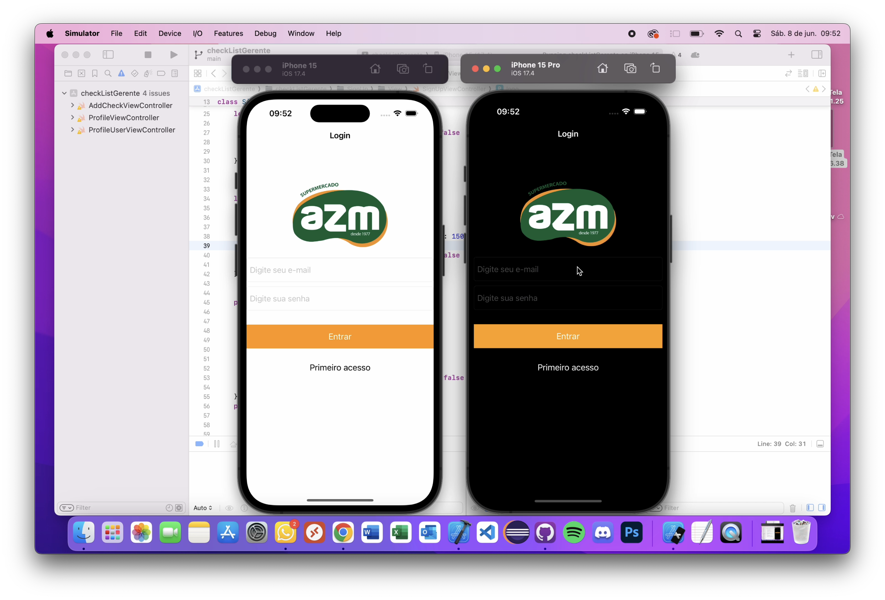

# Aplicativo de Checklist Gerencial para Supermercados 

## **📋 Visão Geral** 

O Aplicativo de Checklist Gerencial para Supermercados foi desenvolvido para otimizar o processo de gerenciamento de tarefas em supermercados. Construído usando Swift com ViewCode, este app utiliza Firebase para autenticação, gerenciamento de banco de dados e soluções de armazenamento. Ele possui dois tipos de usuários - Admin e Usuário - para garantir uma eficiente atribuição e acompanhamento de tarefas.

### **✨ Funcionalidades**

##### Admin

* 📝 Criar e atribuir checklists para os usuários
* 📊 Monitorar a porcentagem de conclusão dos checklists
* 💬 Visualizar comentários deixados pelos usuários nos checklists concluídos

##### Usuário

* ✅ Completar checklists atribuídos
* 🗒️ Adicionar comentários aos checklists concluídos
* 📸 Atualizar foto de perfil

### **🛠️ Stacks**

* Swift: Utilizado para o desenvolvimento do app
* ViewCode: Para construção da interface sem Storyboards
* Firebase Auth: Para autenticação de usuários
* Firebase Realtime Database: Para armazenamento de dados dos usuários e checklists
* Firebase Storage: Para armazenamento das imagens de perfil dos usuários

### **📷 Capturas de Tela**

